## 冰冰SSM多模块开发日志

#### 1.父子工程模块开发

需要在其他子工程的pom.xml文件中引入其他子工程的依赖

```xml
<dependencies>
        <!-- 添加实体类依赖 -->
        <dependency>
            <groupId>com.bingbing</groupId>
            <artifactId>ssm-hotel-entity</artifactId>
            <version>1.0-SNAPSHOT</version>
            <scope>compile</scope>
        </dependency>
</dependencies>
```

#### 2.再次打开IDEA后出现程序包com.bingbing.entity找不到

关闭IDEA，将父工程的.idea文件移出放回，发现子工程目前不再识别为子项目标识，在models中重新导入为maven，运行项目，启动成功。

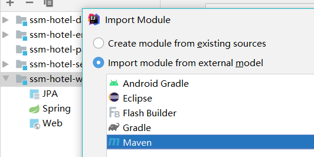

#### 3.web.xml部分标签爆红

没有规范创建web.xml，facets中Deployment Desciptors（项目部署）和Web Resouce Directories（web资源目录）没有同步（文件路径不一致或者其中之一没有配置）

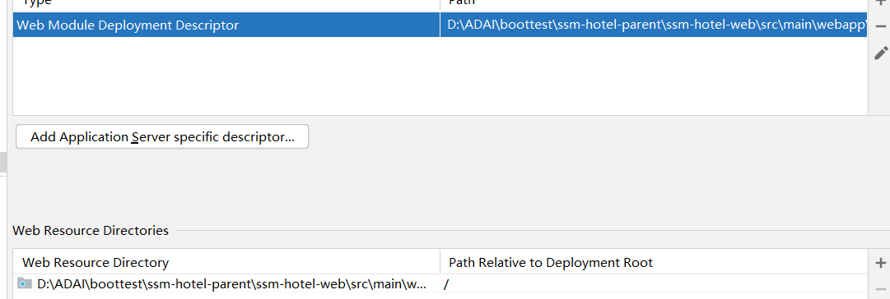

#### 4.静态资源过滤

导入前端页面，给静态资源路径设置，启动项目发现静态资源被过滤

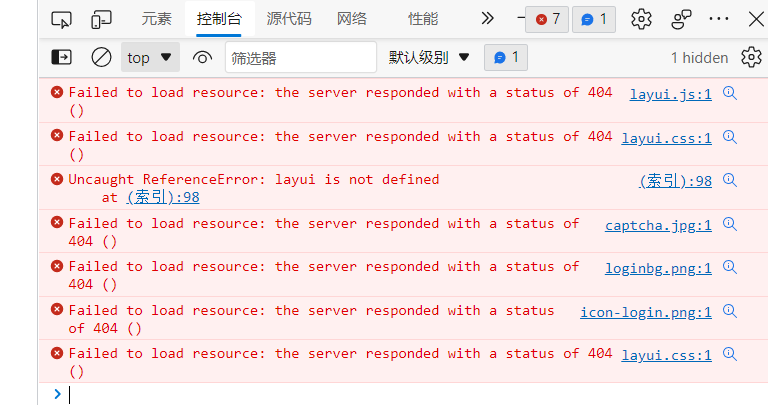

在spring-mvc中统一设置静态资源放行

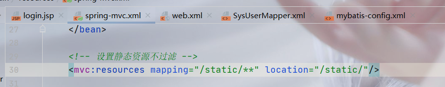

#### 5.使用security框架设置权限认证

将内存用户修改为数据库认证用户

```xml
<!-- 注入密码加密类 -->
    <bean id="passwordEncoder" class="org.springframework.security.crypto.bcrypt.BCryptPasswordEncoder"/>

    <security:authentication-manager>
        <security:authentication-provider user-service-ref="sysUserServiceImpl">
            <!-- 注入密码加密类 -->
            <security:password-encoder ref="passwordEncoder"/>
        </security:authentication-provider>
    </security:authentication-manager>
```

引用业务层之前需要在web子工程的pom.xml文件中加入service模块依赖：

```xml
<dependencies>
        <!--    添加service依赖    -->
        <dependency>
            <groupId>com.bingbing</groupId>
            <artifactId>ssm-hotel-service</artifactId>
            <version>1.0-SNAPSHOT</version>
            <scope>compile</scope>
        </dependency>
    </dependencies>
```

修改失败地址及拦截角色配置

```xml
 <security:http auto-config="true" use-expressions="true">
        <!-- 让登录页面可以匿名访问（无需进行拦截操作） -->
        <security:intercept-url pattern="/login.jsp" access="permitAll()"/>
        <!-- 定义过滤规则 -->
        <security:intercept-url pattern="/**" access="hasAnyRole('ROLE_USER')"/>
        <!-- 设置拦截路径 -->
<!--        <security:intercept-url pattern="/room/detail/**" access="isAuthenticated()"/>-->
        <!-- 配置自定义登录认证页面 -->
        <security:form-login
                login-page="/login.jsp"
                login-processing-url="/login"
                default-target-url="/index.jsp"
                authentication-failure-url="/failure.jsp"
                username-parameter="username"
                password-parameter="password"
        />
        <!--403异常处理-->
        <security:access-denied-handler error-page="/403.jsp"/>
    </security:http>
```

#### 6.遇到No-bean-named-springSecurityFilterChain-available

```xml
<!-- 上下文参数配置 -->
  <context-param>
    <param-name>contextConfigLocation</param-name>
    <!-- 使用*号通配符，通配符前面的字符要一致 -->
    <param-value>classpath*:applicationContext*.xml,classpath*:spring-security.xml</param-value>
  </context-param>
```

俩个 classpath 后面没有使用*

#### 7.提供令牌登录权限，保存Spring Security提供的Token信息，防止403

```html
<%@ taglib prefix="security" uri="http://www.springframework.org/security/tags" %>
<%--携带token提交--%>
            <security:csrfInput/>
```

#### 8.资源又被过滤

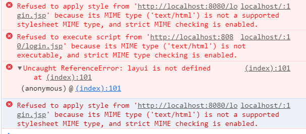

检查spring-security.xml，发现放行目录多写了个字符

```xml
<!-- 设置静态资源匿名访问 -->
    <security:http pattern="/static/**" security="none"/>
```

#### 9.Invalid bound statement (not found): com.bingbing.dao.SysUserMapper.findUserByUserName

applicationContext-dao.xml文件中没有配置连接池

```xml
<!-- 配置连接池 -->
    <bean id="dataSource" class="com.mchange.v2.c3p0.ComboPooledDataSource">
        <property name="driverClass" value="${jdbc.driver}"/>
        <property name="jdbcUrl" value="${jdbc.url}"/>
        <property name="user" value="${jdbc.username}"/>
        <property name="password" value="${jdbc.password}"/>
    </bean>
```

#### 10.localhost拒绝连接

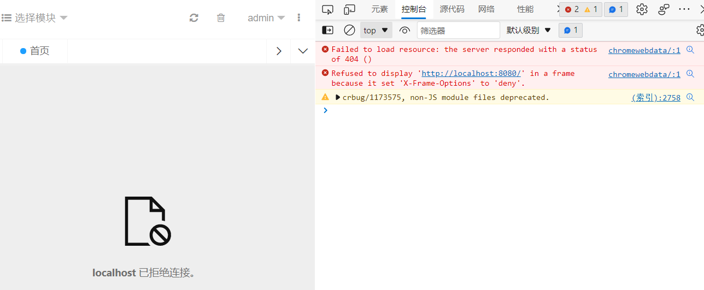

设置Spring Security 防止点击挟持

```xml
<!--防止点击劫持攻击-->
        <security:headers>
            <security:frame-options policy="SAMEORIGIN"/>
        </security:headers>
```

#### 11.使用登录记住我功能

```xml
<!--登录记住我-->
        <security:remember-me data-source-ref="dataSource"
                              token-validity-seconds="1200"
                              remember-me-parameter="remember-me"/>
```

```html
<div class="tip">
                <input type="checkbox" name="remember-me" value="true" lay-skin="primary"></span>
                <span class="login-tip">保持登录</span>
                <a href="javascript:" class="forget-password">忘记密码？</a>
            </div>
```

#### 12.查询列表：创建并使用LayUI的分页类返回

```java
public DataGridViewResult list(DeptVo deptVo) {
    //设置分页信息
    PageHelper.startPage(deptVo.getPage(),deptVo.getLimit());
    //调用查询部门列表的方法
    List<Dept> deptList = deptService.findDeptList(deptVo);
    //创建分页对象
    PageInfo<Dept> pageInfo = new PageInfo<>(deptList);
    //返回数据
    return new DataGridViewResult(pageInfo.getTotal(),pageInfo.getList());
```

#### 13.监听模糊查询

```js
// 监听模糊查询
        form.on('submit(data-search-btn)', function (data) {
            //执行搜索重载
            tableIns.reload({
                where: data.field,//查询条件
                page: {
                    curr: 1
                }
            });
            return false;
        });
```

#### 14.弹出添加层无页面

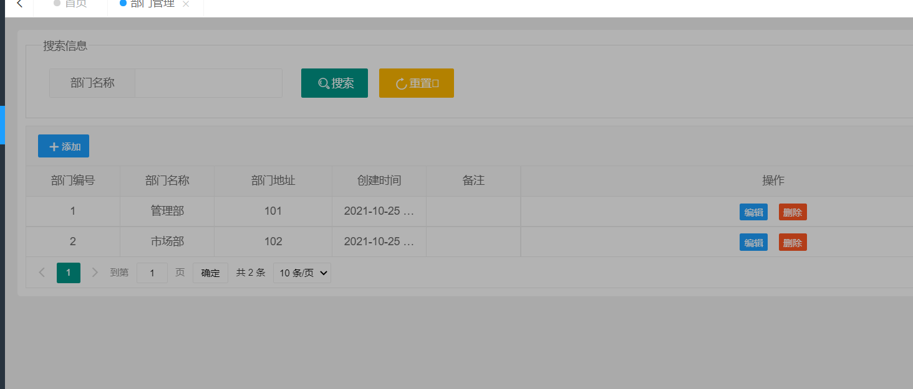

 {
            mainIndex = layer.open({
                type: 1,
                title: '添加部门',
                area: ['800px','400px'],
                content: $("#addOrUpdateWindow"),//引用的窗口内容
                success: function () {
                    //提交地址
                    url = "/admin/dept/addDept";
                }
            });
        }
```

#### 15.添加提交报错前端代码

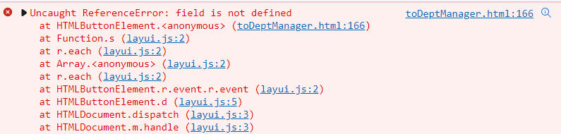

修改前端代码 date,field 为 date.field

```js
$.post(url, data.field, function (result)
```

#### 16.添加提交报错403

在页面<head>标签中的<meta>子标签配置CSRF Token信息

```html
<%-- 获取CSRF Token --%>
<meta name="_csrf" content="${_csrf.token}"/>
<%-- 获取CSRF头 默认为X-CSRF-TOKEN --%>
<meta name="_csrf_header" content="${_csrf.headerName}"/>
```

在具体的Ajax请求中获取<meta>子标签中设置的CSRF Token信息并绑定在HTTP请求头中进行验证

```js
//获取<meta>标签中封装的CSRF Toekn
        var token = $("meta[name='_csrf']").attr("content");
        var header = $("meta[name='_csrf_header']").attr("content");
        //将头中的CSRF Token信息进行发送
        $(document).ajaxSend(function (e, xhr, options) {
            xhr.setRequestHeader(header, token);
        });
```

#### 17.添加提交报错404

```js
layui.use(['form', 'jquery', 'table', 'layer'], function () {
        var $ = layui.jquery,
            form = layui.form,
            table = layui.table,
            layer = layui.layer;
```

没有在参数中使用jquery

#### 18.LayUI数据回显失效

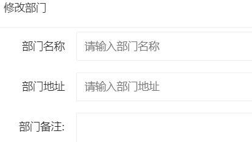

没有在参数中使用jquery

#### 19.修改出现404，设置lay-filter,添加隐藏域

```html
<form class="layui-form" style="width: 90%;" id="dataFrm" lay-filter="dataFrm">
```

```html
 <%--    隐藏域保存主键    --%>
                <input type="hidden" name="id" value="4">
```

#### 20.json数据弹窗显示不出来

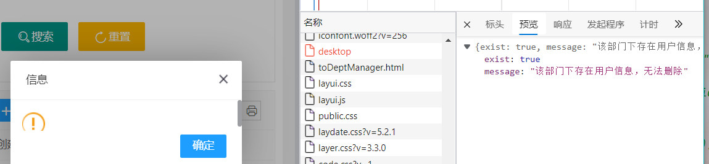

请求结尾没解析json数据

```js
$.get("/admin/dept/checkDeptHasUser",{"deptId":data.id},function (result) {},"json");
```

#### 21.删除出现404

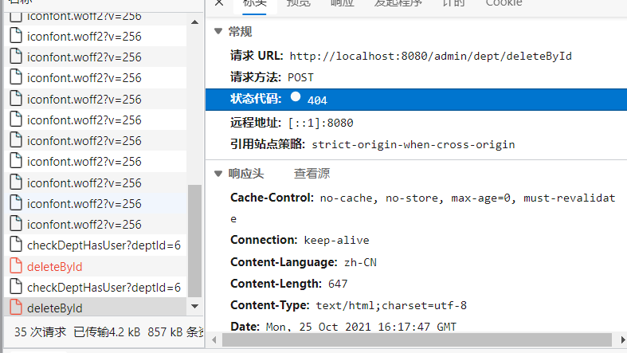

没有找到问题，第二天重新打开IDEA测试运行成功，可能是target文件有问题。

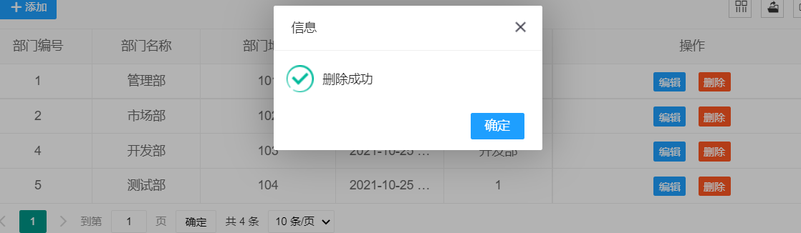

#### 22.删除失败

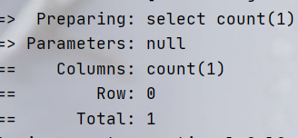

```js
$.post("/admin/role/deleteById", {"roleId": data.id}
```

id传的值和后端没对应上

#### 23.删除角色失败，执行maven.clear

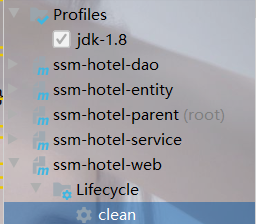

和之前删除失败原因一样。

#### 24.查询500

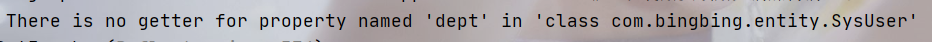

在实体类中定义一对一关系

```java
//一对一
    private Dept dept;
```

#### 25.zarodate异常


设置数据库数据不为0

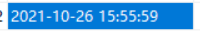

#### 26.避免重复查询数据库使用redis缓存

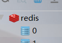

#### 27.添加数据库成功，但前端未反应

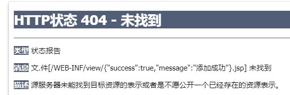

返回json数据，在controller方法添加@ResponseBody注解。

#### 28.重置密码无反应

使用lay-event属性

```html
 <button class="layui-btn layui-btn-xs layui-btn-warm" lay-event="resetPwd">
```

#### 29.分配角色出现464

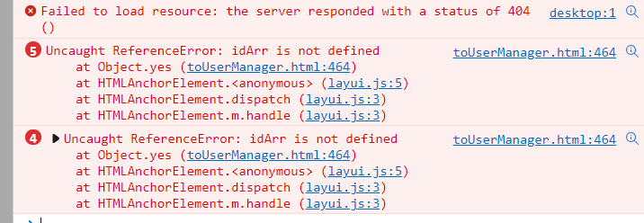

没有定义id数组

```js
//定义数组，保存选中行的ID
                    var idArr = [];
```

#### 30.角色分配失败

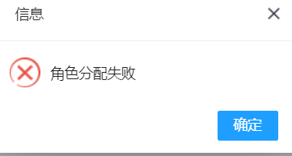

boolean函数没有返回true

```java
boolean saveUserRole   
return true;
```

#### 31.角色分配，前端数组没获得值

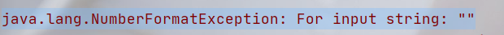

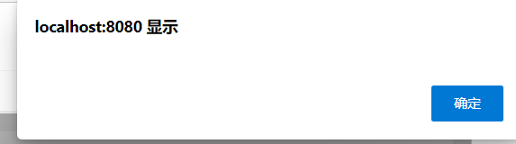

判断条件的长度写错 length

```js
for (let i = 0; i < checkStatus.data.length; i++) {
                            idArr.push(checkStatus.data[i].id);//角色ID
                        }
```

#### 32.使用layui的扩展树组件

```js
 layui.extend({  dtree:"${pageContext.request.contextPath}/static/layui_ext/dtree/dtree"
 })
```

#### 33.树形组件的js和css没找到

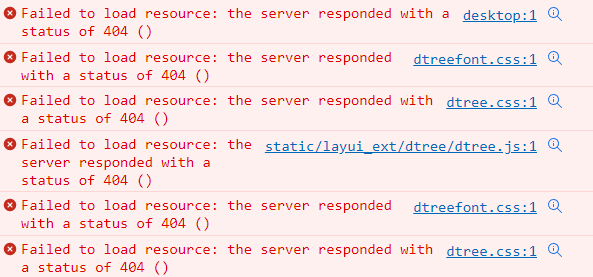

继续clear maven

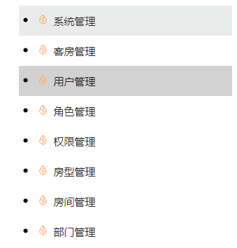

#### 34.添加dataFormat: "list",树结构消失

返回的不是已经存了父子关系的节点集合

```java
return new DataGridViewResult(permissionList);
return new DataGridViewResult(treeNodes);
```

#### 35.调整树组件的阴影宽度

```css
.dtree-theme-item-this{background-color: #d2d2d2!important;width: 180px!important;}
.dtree-theme-item:hover{background-color: #eaeceb!important;width: 180px!important;}
```

清楚浏览器缓存

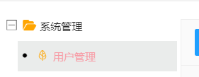

#### 36.父节点ID无法获取

```js
$("#pid").val(obj.param.nodeId);//将选中的节点ID赋值给父节点隐藏域
```

#### 37.图标名称获取

通过.less图标文件获取的值需要补上前缀

```js
//给图标隐藏域赋值
$("#icon").val("fa "+data.icon);
```

#### 38.父级菜单回显后，点击其他二级菜单导致父级菜单多了父级

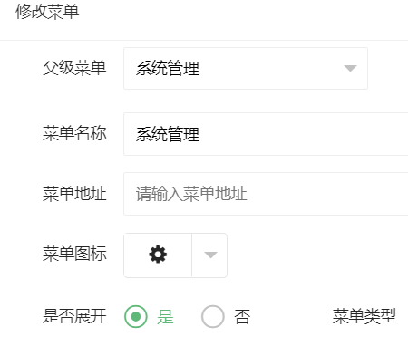

```js
//判断当前选中节点是否是一级菜单/请选择
                    if (data.pid == 0) {
                        menuSelectTree.reload();
                    }
```

#### 39.角色分配菜单，页面中未找到绑定id

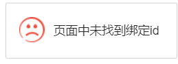

绑定错误：

```js
elem: "#menuTree",
elem: "#roleTree",
```

#### 40.分配菜单系统错误

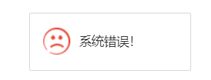

数据库的表名没对应

```java
Table 'db_ssm_hotel.sys_role_permission' doesn't exist
```

#### 41.500异常

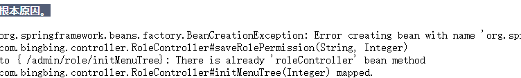

使用了重复的RequestMapping注解

#### 42.点击提交，跳转出错

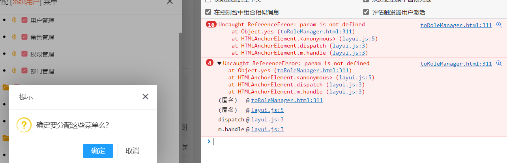

没有吧选择节点的id放进数组

```js
   idArr.push(params[i].nodeId);//nodeId是选中的节点值
```

